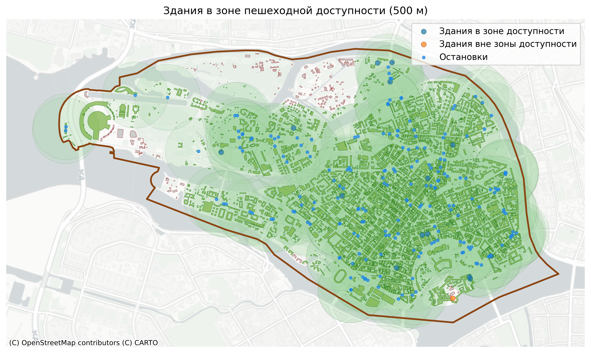

# urban_GIS-analytics
## Проекты

### 1. Транспортная доступность зданий (Санкт-Петербург)
Анализ доли зданий, находящихся в пределах 500 м от остановок общественного транспорта.

### 2. Обеспеченность районами кафе (Санкт-Петербург)
Исследование пространственного распределения объектов общественного питания.

### 3. Культурная инфраструктура (Томск)
Анализ распределения и разнообразия культурных учреждений по районам города.

## Используемые инструменты

- Python (OSMnx, GeoPandas, Pandas)
- QGIS
- Пространственный анализ
- Визуализация данных

Пример работы:

